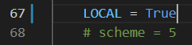
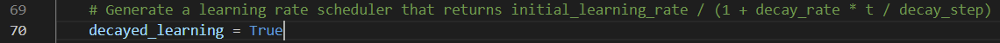
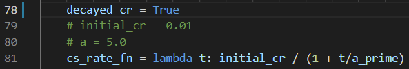
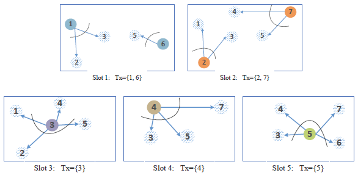

# JSAC-FL
*Compression-based decentralized stochastic gradient descent (DSGD) algorithm tailored for digital and analog wireless implementations*

## Table of Contents
* [General Info](#General-Info)
* [Setup](#System-Requirement)
* [How the code works](#How-the-code-works)
  * [Different Schemes](#Different-Schemes)
  * [Scheduling Algorithms](#Scheduling-Algorithms)
* [Acknowledgements](#Acknowledgements)
* [How to cite](#How-to-cite)
* [Contact Info](#Contact-Info)


## General Info
This repository includes the source code for the work "[Federated Learning over Wireless Device-to-Device Networks: Algorithms and Convergence Analysis](https://ieeexplore.ieee.org/document/9563232)," which is the journal version of the earlier work "[Decentralized Federated Learning via SGD over Wireless D2D Networks](https://ieeexplore.ieee.org/document/9154332)". Compared with the conference version, this work adopted the dimension-reduction *random linear coding (RLC)* as the compression scheme for its low implementation conmplexity and ease of analysis, and proposed a decaying consensus stepsize to combat channel noise in the analog implementation.

## Setup
- Python 3.9.2
- [TensorFlow](https://www.tensorflow.org/install) 2.5.0 \# Python-based framework to build and develop ML models
- [CVXPY](https://www.cvxpy.org/index.html) 1.1.15 \# Python-embedded modeling language for convex optimization problems
- [NetworkX](https://networkx.org/documentation/stable/index.html) 2.5 \# Python package for the creation, manipulation, and study of the structure, dynamics, and functions of complex networks

## How the code works
- Users can run [fashion_mnist.py](fashion_mnist.py) using either command line arguments, e.g., to implement analog implementation over a planar grid graph with channel uses , learning rate }=\tfrac{3.25}{\mu}\tfrac{1}{t&plus;200}), and consensus step size }=\tfrac{0.05}{t/1000&plus;1}), by  typing

    `python fashion_mnist.py --scheme=4 --topology='torus' --P=2e-7 --N=8000 --a=200 --zeta0=0.05 --a_prime=1000`  

    or running the python file directly with all arguments specified in the default values.
- An equal number   of data samples are distributed from [Fashion-MNIST](https://www.tensorflow.org/datasets/catalog/fashion_mnist) for all available classes at device  , which is, by denoting ,obtained by solving the following problem

      
    where  is the set of all training samples labelled as class ,  is a maxitrix of indicator functions with its entries  denoting whether class  is available at device  or not, and  is the -th row vector of the matrix .
    - This problem is automatically solved when running [fashion_mnist.py](fashion_mnist.py) by calling the function `solve_num_per_class` defined in [utils.py](utils.py).
    - This problem assues that dataset 's is distributed without overlapping with each other, . 
- [digital_schemes.py](digital_schemes.py) and [analog_schemes.py](analog_schemes.py) are lower level methods called by [fashion_mnist.py](fashion_mnist.py), which executes one update of }), and/or }), and/or }), , for (noiseless) digital and analog implementations, respectively.
- [utils.py](utils.py) is a lower level method called by [digital_schemes.py](digital_schemes.py), [analog_schemes.py](analog_schemes.py) and [fashion_mnist.py](fashion_mnist.py).
- [optimum_obj_value.py](optimum_obj_value.py) is a standalone file for numerically computing the optimal  by the standard DSGD algorithm (w/o compression).

### Different Schemes
- "scheme == 1" corresponds to the standard DSGD algorithm w/o compression (**ideal commun.**)
- "scheme == 2" and "scheme == 3" correspond to (noiseless) digital implementations of the compression-based DSGD algorithm by the greedy coloring-based scheduling policy and TDMA-based transmission, respectively. (**digital**)
- "scheme == 4" and "scheme == 5" correspond to analog implementations of the compression-based DSGD algorithm by the sequential scheduling policy (described in Algorithm 3) and TDMA-based AirComp receiving, respectively. (**analog**)
- "scheme == 6" returns empirical constituent error, and is no longer maintained. (**legacy**)
- Local training is implemented by setting (**no commun.**)  
    
- **Notes:** *decaying* learning stepsize and *decaying* consensus rate are controlled by 
      
    and  
      
    respectively.

### Scheduling Algorithms
- The digital and analog implementations of the compression-based DSGD algorithm, in general, apply to any scheduling policies that meet sompe principles set in the paper. Scheduling polices can thus be customized by modifying the functions `TwoSectionH` and `seq_scheduling` defined in [utils.py](utils.py) for digital and analog transmission, respectively. 
- An example showing the outcome of the greedy coloring-based scheduling for digital transmission over a connectivity graph (c.f.~Fig. 1 in the paper)
    
- An example showing sequential scheduling for analog transmission has been illustrated in Fig. 9 of the paper.

## Acknowledgements
- Among many prior arts cited in the paper, this work was mostly inspired by [Anastasia Koloskova](https://scholar.google.com/citations?user=ldJpvE8AAAAJ&hl=en)'s work "[Decentralized Stochastic Optimization and Gossip Algorithms with Compressed Communication](http://proceedings.mlr.press/v97/koloskova19a.html)".
- Very grateful to [Joshua Li](https://github.com/joshualee155)'s technical advice for developing this repository

## How to cite
[1] H. Xing, O. Simeone, and S. Bi, "[Decentralized Federated Learning via SGD over Wireless D2D Networks](https://ieeexplore.ieee.org/document/9154332),” in *IEEE International Workshop on Signal Processing Advances in Wireless Communications (SPAWC)*, May 2020. 
```
@inproceedings{xing20FL,
	title={Decentralized Federated Learning via {SGD} over Wireless {D2D} Networks},
	author={Xing, Hong and Simeone, Osvaldo and Bi, Suzhi},
	booktitle={IEEE International Workshop on Signal Processing Advances in Wireless Communications (SPAWC)},
	address={Atlanta, GA, USA},
	month=may,
	year={2020}
}
```
[2] H. Xing, O. Simeone, and S. Bi, "[Federated Learning over Wireless Device-to-Device Networks: Algorithms and Convergence Analysis](https://ieeexplore.ieee.org/document/9563232),” *to appear in IEEE J. Sel. Areas Commun.*, 2021.

```
@ARTICLE{xing21FL,
	author={Xing, Hong and Simeone, Osvaldo and Bi, Suzhi},
	journal={to appear in {IEEE} J. Sel. Areas Commun.}, 
	title={Federated Learning over Wireless Device-to-Device Networks: Algorithms and Convergence Analysis}, 
	year={2021},
}
```
## Contact Info
- [Xing, Hong](https://scholar.google.com.sg/citations?user=rfhrifoAAAAJ&hl=en), e-mail: hong.xing AT szu.edu.cn
- [Simeone, Osvaldo](https://nms.kcl.ac.uk/osvaldo.simeone/index.htm), e-mail: osvaldo.simeone AT kcl.ac.uk
- [Bi, Suzhi](https://sites.google.com/view/bisuzhi/), e-mail: bsz AT kcl.ac.uk
